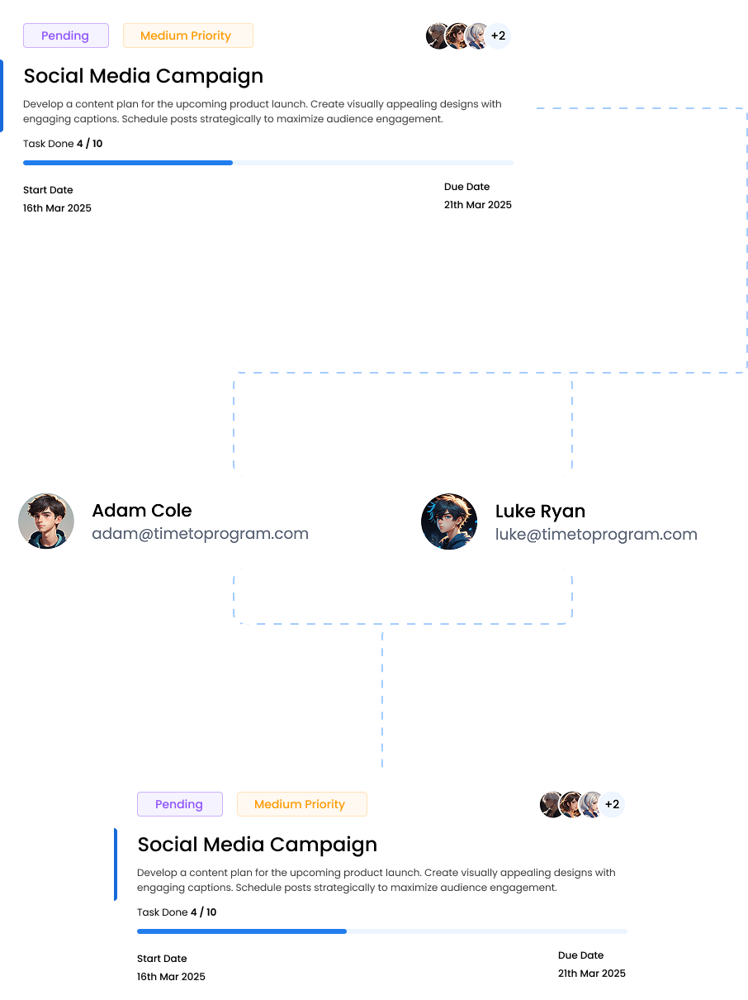

# 🗂️ Task Manager

A **full-stack task management system** that allows **admins** to assign tasks to users and **track their progress** efficiently.  
Built with **Node.js**, **Express**, **MongoDB**, **React**, and **Tailwind CSS** — it offers a clean, responsive UI and secure authentication using **JWT**.

---

## 🚀 Features

✅ **User Authentication & Authorization**
- Secure login, register, and logout using JWT.
- Role-based access: **Admin** & **Member**.

✅ **Task Management**
- Create, update, and delete tasks.
- Assign tasks to specific users.
- Track task status: *Pending*, *In Progress*, *Completed*.
- Attach files to tasks.

✅ **Analytics & Reporting**
- Export reports to Excel:
  - All tasks across all users.
  - Tasks filtered by specific users.
- Search, filter, and sort tasks.

✅ **User Experience**
- Real-time task updates.
- Dashboard for quick insights.
- Notifications for assignments and updates *(planned)*.

✅ **Admin Dashboard**
- Manage users.
- View team progress.
- Export detailed Excel reports.

---

## 🧰 Tech Stack

### 🖥️ Frontend
- **React.js**
- **Tailwind CSS**
- **Axios**
- **Moment.js**

### ⚙️ Backend
- **Node.js**
- **Express.js**
- **MongoDB (Mongoose)**
- **ExcelJS**
- **JSON Web Token (JWT)**

---

